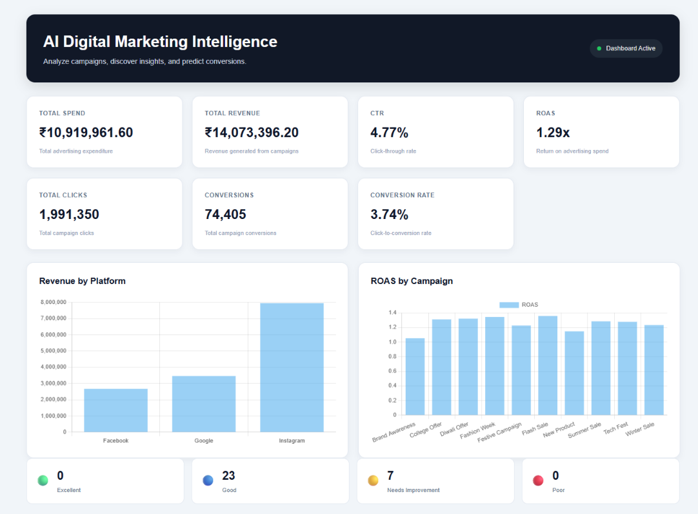
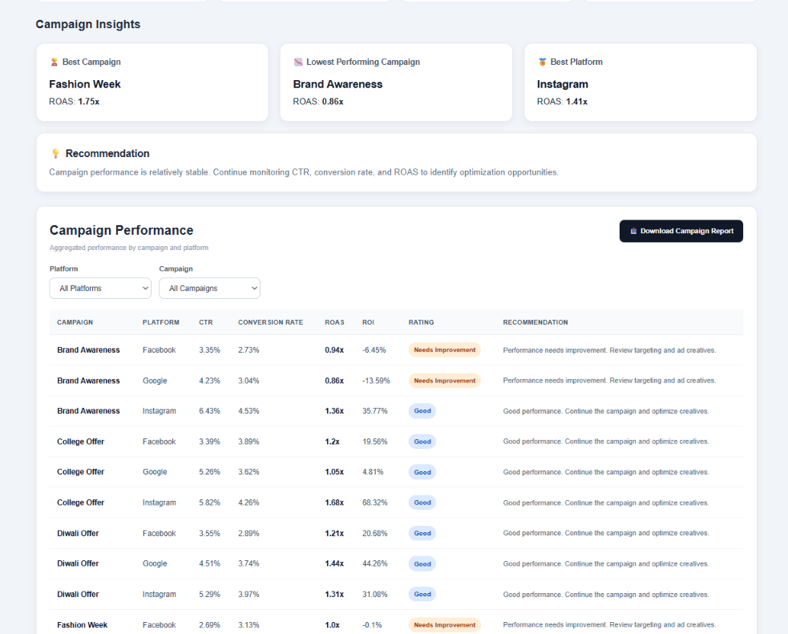

## 📈 Dashboard

The platform provides an interactive dashboard for monitoring campaign performance, analyzing platforms, and generating marketing insights.

### Dashboard Overview

### Campaign Analysis

The dashboard includes:

- Overall campaign KPIs
- Revenue and ROAS visualizations
- Campaign performance ratings
- Best and worst campaign identification
- Platform performance analysis
- Automated recommendations
- Campaign filtering
- Conversion prediction
- CSV report export